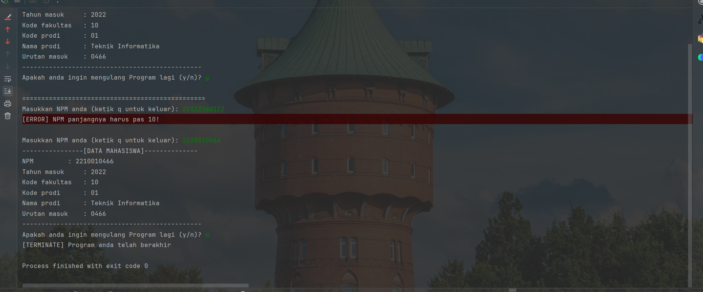

# 📚 NPM Convertion

## Deskripsi

Program ini digunakan untuk melakukan konversi NPM Mahasiswa yang dimasukkan oleh pengguna. Program akan memproses NPM yang valid, memecahnya menjadi beberapa komponen (tahun masuk, kode fakultas, kode prodi, dll.), dan menampilkan informasi mahasiswa berdasarkan NPM tersebut.

## Struktur Proyek

- `Main.java`: Berisi logika utama program.
- `MahasiswaEntity.java`: Kelas model untuk menyimpan informasi mahasiswa.
- `Npm.java`: Berisi logika untuk memvalidasi dan mengonversi NPM menjadi objek `MahasiswaEntity`.

## Cara Menggunakan

1. Jalankan program.
2. Masukkan NPM ketika diminta.
3. Program akan menampilkan informasi mahasiswa jika NPM valid.
4. Pengguna dapat memilih untuk mengulang program atau keluar.

## Contoh Tampilan Program

```plaintext
Masukkan NPM anda (ketik q untuk keluar): 2210010466
----------------[DATA MAHASISWA]--------------
NPM             : 2210010466
Tahun masuk     : 2022
Kode fakultas   : 10
Kode prodi      : 01
Nama prodi      : Teknik Informatika
Urutan masuk    : 0466
-----------------------------------------------
Apakah anda ingin mengulang Program lagi (y/n)? n
[TERMINATE] Program anda telah berakhir
```



### File: `Main.java`

```java
import java.util.Scanner;
```
- Mengimpor kelas Scanner untuk membaca input dari pengguna.
<br/>

```java
public class Main {
    public static void main(String[] args) {
...
    }
}
```
- Mendeklarasikan kelas Main dan method main sebagai titik utama program berjalan (Pusat program ada disini)

```java
 while (true) {
            try {
                String npm = Main.readInput("Masukkan NPM anda (ketik q untuk keluar): ");
                if (Main.isExit(npm)) {
                    System.out.println("[TERMINATE] Program berakhir!");
                    break;
                }
                MahasiswaEntity mahasiswa = Npm.convert(npm);

                System.out.println("----------------[DATA MAHASISWA]--------------");
                System.out.println("NPM \t\t: " + mahasiswa.npm);
                System.out.println("Tahun masuk\t\t: " + mahasiswa.tahun);
                System.out.println("Kode fakultas\t: " + mahasiswa.kodeFakultas);
                System.out.println("Kode prodi\t\t: " + mahasiswa.kodeProdi);
                System.out.println("Nama prodi\t\t: " + mahasiswa.namaProdi);
                System.out.println("Urutan masuk\t: " + mahasiswa.urutanMasuk);
                System.out.println("-----------------------------------------------");

                String repeat = readInput("Apakah anda ingin mengulang Program lagi (y/n)? ");

                repeat = repeat.toLowerCase();

                if (!repeat.equals("y")){
                    System.out.println("[TERMINATE] Program anda telah berakhir");
                    break;
                }
                System.out.println();
                System.out.println("================================================");
            } catch (Exception err) {
                System.out.println("[ERROR] " + err.getMessage());
                System.out.println();
            }
        }
    }
```

- Kode ```java while (true) {...} ``` untuk melakukan perulangan terus menerus sampai di berhentikan menggunakan ```java break```
- Kode ```java try {
    ...
} catch (Exception err) {
    ...
}``` berfungsi untuk mengecek apakah ada Error atau tidak jika terdapat error maka akan di kirim ke catch. dan jika tidak ada error maka catch tidak akan di eksekusi
- Kode ```java  String npm = Main.readInput("Masukkan NPM anda (ketik q untuk keluar): ");``` ini berfungsi untuk membaca Inputan, disini saya menggunakan Method static dari readInput
- Kode ```java if (Main.isExit(npm)) {
          ....
  }``` Berfungsi untuk melakukan pengecekan apakah user mengetikkan q / quit pada terminal jika iya akan menghentikan programnya
  - Kode ```java break;``` digunakan untuk menghentikan perulangan (berkaitan dengan kode ```java if (Main.isExit(npm))``` ) jika quit maka kode break dihentikan
  - 
